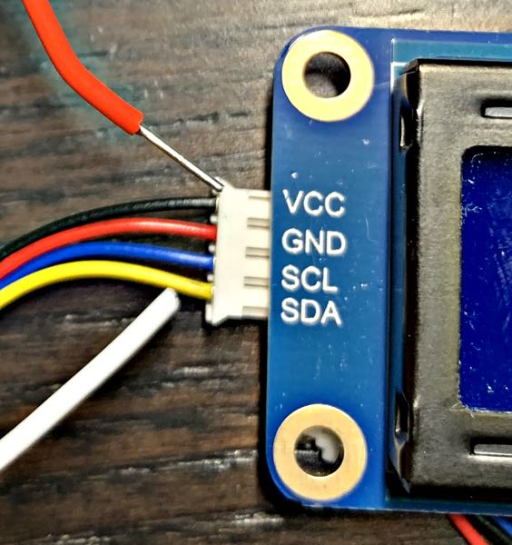

# `circuitpython-waveshare-1602`

This project is a small driver for the [Waveshare LCD1602 RGB module][wiki],
a 16-column wide and 2-row tall character display with a controllable RGB
backlight. It has a four-pin I2C interface (voltage, ground, SCL and SDA).

Waveshare do make available [a driver library for micropython][wiki], but
it uses the [`writeto_mem` I2C method][mp], which isn't made available by
the circuitpython I2C library.

[wiki]: https://www.waveshare.com/wiki/LCD1602_RGB_Module
[mp]: https://docs.micropython.org/en/latest/library/machine.I2C.html#machine.I2C.writeto_mem

Included in this repo is the [Waveshare datasheet][wd], which is a bit sparse,
and also the [Hitatchi HD44780 datasheet][hd], on which it seems to be based.

[wd]: LCD1602_RGB_Module.pdf
[hd]: HD44780.pdf

## Usage

Place the `rgb1602` directory and all the files under `lib` into the `lib`
directory of your circuitpython projects.

Import the `rgb1602` library and create an instance of the `Screen` class by
passing in the pins you’re using for SCL (I2C clock) and SDA (I2C data):

```python
from board import GP26, GP27
from rgb1602 import Screen

screen = Screen(sda_pin=GP26, scl_pin=GP27)
```

### Writing to the display

To write to the display use the `Screen.update` method, which takes one or two lines:

```python
screen("Hello, world!")
screen("How are", "you today?")
```

Partial updates are possible as well (positions are 0-indexed):

```python
screen.write_at_position("tonight?", col=4, row=1)
```

The `Screen.update` method clears the screen before writing, and the screen can be
cleared separately:

```python
screen.clear()
```

`Screen.update` and `Screen.write_at_position` both use `Screen.position_cursor`
to do their work, if you have a use that requires positioning the cursor without
writing characters to the display. (Cursor display and blinking are not
implemented in this library, but the constants are present.)

### Using the built-in character set

The display uses an 8-bit character set, which can be described as ASCII plus
some Japanese characters, plus a few symbols. The character set table is shown
in the [Hitachi datasheet][hd] as table 4, on page 17 (ie ROM `A00`, not the
alternative shown on page 18).

I’ve added a method to look up certain symbol names or Unicode characters with
what seem to me to be reasonable equivalents in the display’s character set.

Note that it returns `bytes`, not `str`, as it’s giving you a numeric value
that causes the display to show a certain character, _not_ an actual character
that makes sense to otherwise make use of in your program.

```python
screen.update(
    b"Outside: 14" + screen.special_char("°") + b"C"
)
```

Note that `screen.special_char` only implements a subset of the character set,
mostly because I either couldn’t tell what the characters were meant to be,
or didn’t expect to use them myself.

### Controlling the backlight

You can set the backlight colour via RGB values, or by CSS colours ("color" is also
supported to make everyone’s lives easier):

```python
screen.set_rgb(0, 0, 0)  # White on blue text.
screen.set_white()  # Same as above.
screen.set_css_colour("chocolate")
```

You can set the backlight power to be on or off:

```python
screen.set_backlight_power(False)  # Turns the backlight off.
```

Note that turning the backlight off doesn't turn the screen off
entirely. There is a command you can send to the LCD controller to "turn
off" the display but it’s not implemented in this library. Though the
constant is present and the bit pattern commented if you want to do so,
and see also the [Waveshare datasheet](LCD1602_RGB_Module.pdf) for
further information on the commands that can be sent (though it’s not
brilliant).

## Choosing a backlight colour

The display by default has white text on a blue background. It struggles
to represent quite a few colours, so I’ve implemented an example routine
that shows each of the CSS colours in turn with a delay between them.

```python
from board import GP26, GP27
from rgb1602 import Screen
from rgb1602.examples import show_css_colours

lcd = Screen(sda_pin=GP26, scl_pin=GP27)
show_css_colours(screen)
```

Also in the examples module are:

- `show_waveshare_colours`, which displays the colours from
  Waveshare’s own sample code. (Some of these really do not
  show up accurately — "cyan" appears bright green.)
- `show_discoloration_sample` runs the `discoloration`
  example from the Waveshare sample code, which sweeps
  through the RGB space.

## Project status

Maintained as of 2022-03-03 but no promises of further development,
or implementation of the display-supported features that this
library lacks.

_That said_ if you want to do any of that then I’ll gladly look
at pull requests.

(Also, as is probably clear, this is one of my first projects
interfacing directly with hardware, so I'd appreciate any
fixes, improvements and advice!)

## Wiring warning

The display operates over I2C and has a 4-pin JST PH connector so I’m sure
you’re thinking “I can use a [Stemma connector][stemma]”. **Please stop!**

Note that on the Waveshare LCD1602 the wires are weirdly mirrored: the
VCC and ground are swapped, as are the I2C clock and data. So you _can_
use a Stemma connector but please make sure to swap the voltage and
ground, and then swap the clock and data wires.



[stemma]: https://learn.adafruit.com/introducing-adafruit-stemma-qt
